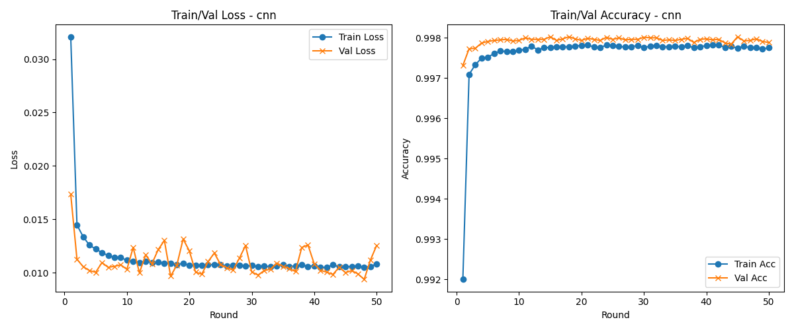

## Federated-Learning-IoT-IDS
### Federated Learning-based Anomaly and Intrusion Detection System for Smart Home Environments

### Author: Haoyu Wang & Hongwei Zhang

### File Description:    
1. Main Model: [Federated_IDS_Model.py](Federated_IDS_Model.py)

2. Dataset Preprocessing:
   1. CIC IoT-DIAD 2024 dataset   
      1. Multi-class classification: [DIAD-Multi.ipynb](DatasetPreprocessing/DIAD-Multi.ipynb)
      2. Binary classification: [DIAD-Binary.ipynb](DatasetPreprocessing/DIAD-Binary.ipynb)
   2. CIC IoMT dataset 2024   
      1. Multi-class classification: [IoMT-Multi.ipynb](DatasetPreprocessing/IoMT-Multi.ipynb)
      2. Binary classification: [IoMT-Binary.ipynb](DatasetPreprocessing/IoMT-Binary.ipynb)

3. Federated Learning Results:      
   1. Multi-class classification:     
      1.    
      2.    
      3.    
   2. Binary classification:   
      1.    
      2.    
      3.    

4. Centralized Learning Results:    
   1. [Multi-class classification](Results/Centralized/multi.csv)  
   2. [Binary classification](Results/Centralized/binary.csv)  

**Datasets:** 
1. [CIC IoT-DIAD 2024 dataset](https://www.unb.ca/cic/datasets/iot-diad-2024.html)    
2. [CIC IoMT dataset 2024](https://www.unb.ca/cic/datasets/iomt-dataset-2024.html)

